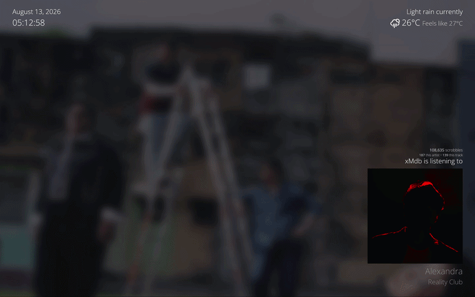

# Listening

A self-hosted fullscreen Last.fm now-playing display with artwork, local weather, listening statistics, and embeddable status endpoints. Made in spite because Last.fm's `/now` profile endpoint is a premium only feature, and is... pretty bad... for the lack of a better word.

<p align="center">
  
  <br>
  <br>
  <a href="https://listening-xmdb.vercel.app/">
    
  </a>
  <br>
  <sub><i>(this is live)</i></sub>
</p>

## Overview

Listening follows the current or most recently scrobbled track from a selected Last.fm account. It displays the album cover, track and artist names, total scrobbles, and personal artist and track play counts.

When Spotify credentials are available, Spotify supplies the album artwork and artist photo. The artist photo is used as the default fullscreen background, falling back to the album cover when necessary. Colors extracted from the cover are brightened and applied to the track and artist text.

Time, weather, and extended listening information are visible by default. A fresh browser starts without a selected Last.fm account and prompts the visitor to enter one in Listening preferences, unless set in the .env. Display preferences are stored locally in the visitor's browser.

## Controls

The controls appear briefly when the page opens and reappear when the bottom-left corner is hovered.

| Key | Action |
| --- | --- |
| `w` | Toggle local weather |
| `t` | Toggle time and date |  
| `e` | Toggle extended Last.fm information |
| `h` | Toggle the control menu |
| `s` | Open or close Listening preferences |
| `Esc` | Close Listening preferences |

Press `s` to open the preferences panel. Changes are applied after selecting *Save preferences* and persist in local storage.

Available preferences include:

- A Last.fm username to follow.
- A display name for the fullscreen listening label. This is independent of the tracked account.
- Artist, album, or solid-black backgrounds.
- Background blur toggle.
- Custom longitude and latitude for the weather.
- 24-hour time, weekday, and seconds toggle display.

## Endpoints

Listening exposes several routes for websites, profile READMEs, and other integrations. They are intentionally not linked from the fullscreen display.

| Route | Description |
| --- | --- |
| `/api/now-playing` | Normalized current or recent listening data as JSON |
| `/api/now-playing?user=xmdb` | Listening data for a selected public Last.fm account |
| `/api/weather?lat=14.56&lon=121.00` | Cached OpenWeatherMap conditions for a location |
| `/api/card` | Artwork-backed now-playing SVG |
| `/now.svg` | Short alias for the SVG card |
| `/now.svg?name=Lance` | SVG card with a public display-name override |
| `/now.svg?user=xmdb&name=Lance` | SVG card with account and display-name overrides |

The `user` query parameter selects the Last.fm account. When `LASTFM_USERNAME` is set, selecting a different account requires `ALLOW_CUSTOM_LASTFM_USERS=true`. If `user` is omitted or blank, the endpoint uses `LASTFM_USERNAME` when one is configured; otherwise it returns a prompt response instead of attempting a Last.fm request. The `name` parameter only changes the label rendered in a card. URL-encode names containing spaces.


## Configuration

Copy `./.env.example` to `./.env` and fill out the services you want to use. Only a Last.fm API key is required for playback data.

```env
LASTFM_API_KEY=replace-with-your-lastfm-api-key
LASTFM_USERNAME=empty-or-replace-with-your-lastfm-username
ALLOW_CUSTOM_LASTFM_USERS=true-or-false-or-empty

SPOTIFY_CLIENT_ID=replace-with-your-spotify-client-id
SPOTIFY_CLIENT_SECRET=replace-with-your-spotify-client-secret

OPENWEATHERMAP_API_KEY=replace-with-your-openweathermap-api-key
```

## API requirements

### Last.fm

Track metadata and personal listening statistics come from the [Last.fm API](https://www.last.fm/api). Create a [Last.fm API account](https://www.last.fm/api/account/create) here.

The Last.fm shared secret and callback URL are not used. Listening checks for playback changes every seven seconds while the tab is visible and refreshes immediately when the tab regains focus. Playback responses are cached per account for five seconds. Personal play counts remain account-specific, while Spotify artwork and embedded card images are shared when accounts resolve to the same song or image.

When `LASTFM_USERNAME` is omitted or empty, Listening accepts the account saved in visitor preferences without requiring another setting. If a server fallback is configured, set `ALLOW_CUSTOM_LASTFM_USERS=true` to allow other usernames from visitor preferences or endpoint queries. Set it to `false` if the deployment should accept only its configured `LASTFM_USERNAME`; note that a visitor would then need to enter that same username in Listening preferences. On a public deployment, each newly requested username can result in additional Last.fm traffic.

### Spotify artwork

Album covers and artist photos are provided by the [Spotify Web API](https://developer.spotify.com/documentation/web-api).

Listening uses the Client Credentials flow. It does not require an end-user login, authorization callback, or refresh token. If the Spotify dashboard requires a redirect URI while creating the application, `http://127.0.0.1:3000/callback` is okay because Listening does not visit it.

Spotify is optional. Without it, the Last.fm album image is used for the cover and as the background fallback. Access tokens renew automatically, and complete artwork results are cached for six hours.

### Weather

Weather comes from the [OpenWeatherMap Current Weather API](https://openweathermap.org/current).

By default, the browser requests location once per page session and reuses those coordinates. A custom latitude and longitude can be saved in Listening preferences instead. Weather results refresh every ten minutes and are cached in browser storage, the running server instance, and HTTP caches.

## Development

Listening requires Node.js 22.

```sh
npm ci
npm run check
npm run dev
```

`npm run check` runs the complete test suite, TypeScript validation, and a production build.

## Attribution

Listening's visual language is heavily inspired by [Descent](https://github.com/JasonPuglisi/descent) by Jason Puglisi. Listening is written independently.

Music data is provided by [Last.fm](https://www.last.fm/), artwork by [Spotify](https://spotify.com/) when configured, and weather data by [OpenWeatherMap](https://openweathermap.org/). The Last.fm favicon and interface mark use the Font Awesome Free icon.

## Moving Forward...

Listening remains primarily a self-hosted service, but deployments can opt in for user-slected Last.fm accounts. Note that this can increase API usage depending on traffic. Since not everyone has a Last.fm account, Spotify or Apple Music account integration may be an option in the future.

I am always open to PRs.
